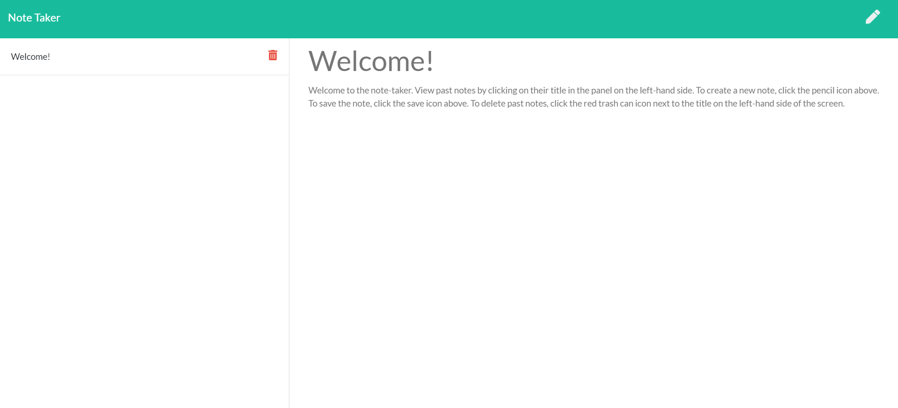

# note-taker

## Description
This application allows the user to view, save, and delete notes with an easy, intuitive interface. The backend was created using express and node. The frontend was coded using jQuery and regular Javascript. While this application lacks the features of other note applications, this application represents the first express-based server that I have ever created. 

## Background
Trilogy, a brand of 2U Inc, coded the front-end of the application. More specifically, Trilogy's team wrote the HTML, CSS, and Javascript files that rendered the final output in the browser. Doing so gave me the valuable opportunity to focus on the back-end and refine my skills with express.js.

[Click here to access this application](https://hidden-ridge-63284.herokuapp.com/)